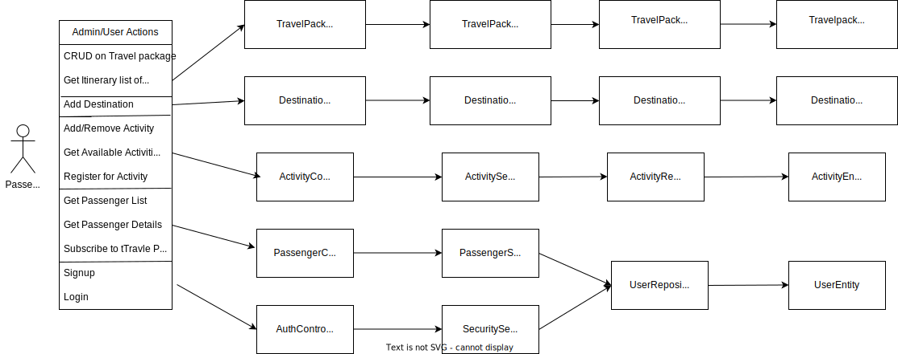
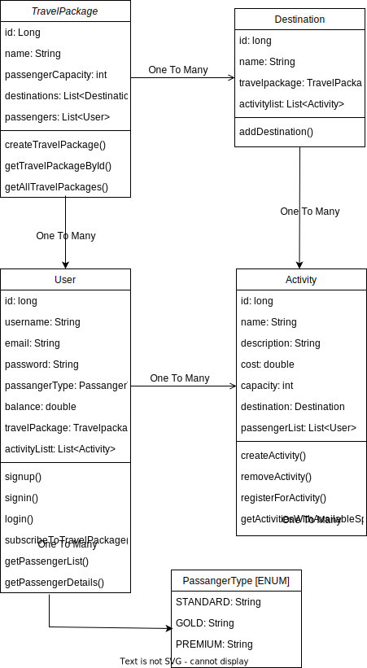

# Project : Elysian Travels

## Overview
Elysian Travels is a dynamic travel management system empowering travel agencies to
organize travel packages, itineraries, and passenger registrations with ease.
## Functional Requirements
#### Travel Packages:

- Each package has a name, passenger capacity, destinations, and a passenger roster.
- Destinations include a name and a list of activities.
#### Activities:

- Each activity has a name, description, cost, and capacity.
- Activities are associated with specific destinations.
#### Passenger Registration:

- Passengers sign up for activities within a travel package.
- Activity capacities are enforced.
#### Passenger Types:

- Standard passengers have a balance deducted for each activity.
- Gold passengers enjoy a 10% discount.
- Premium passengers register for activities for free.
#### Itinerary Printing:

- Print the itinerary for a travel package, showcasing package name, destinations, and activity details.
#### Passenger List Printing:

- Print the passenger list, including package name, capacity, and details of each enrolled passenger.
#### Passenger Details Printing:

- Print details of an individual passenger, including name, number, balance, and signed-up activities.
#### Available Activities Printing:

- Print details of activities with available spaces.
## Enhanced Features
#### Security:

- JWT authentication ensures secure endpoints.
- Role-based access control (admin/user roles) is implemented.
- User Role : sign up for packages, subscribe to activities, and view their details.
- Admin Role : Admins perform all user actions, create packages, add destinations, and view passenger lists.
#### Exception Handling:

- Robust exception handling for graceful error management.
#### Unit Testing:

- Comprehensive JUnit tests for each class and method.
#### Documentation:

- Thorough Java code documentation for clarity.
## High Level Design


## Low Level Design



## API Documentation

### Signup

1. Role = user
   - Endpoint POST : http://localhost:8080/api/auth/signup
   - Request Body
```json
{
  "username": "test",
  "email" : "test@test.com",
  "password" : "12345678"
}
```

2. Role = admin
   - Endpoint POST : http://localhost:8080/api/auth/signup
   - Request Body
```json
{
  "username": "ManjotKaur",
  "email" : "manjot@test.com",
  "password" : "12345678",
  "role": ["admin"]
}
```
- Response Body
```json
{
  "message": "User registered successfully!"
}
```

### Signin
- Endpoint POST : http://localhost:8080/api/auth/signin
  - Request Body
```json
{
  "username": "test",
  "password" : "12345678"
}
```
- Response Body
```json
{
  "id": 1,
  "username": "test",
  "email": "test@test.com",
  "roles": [
    "ROLE_USER"
  ],
  "accessToken": "eyJhbGciOiJIUzI1NiJ9.....",
  "tokenType": "Bearer"
}
```

### Create Travel Package [Admin role]
- Endpoint POST : http://localhost:8080/api/travelPackage
  - Request Header : Authorization "Bearer {accessToken}"
  - Request Body
```json
{
  "name": "Titanic",
  "passengerCapacity": "1000"
}
```
- Response 201 Created

### Print Itinerary [Admin/User role]
- Endpoint GET : http://localhost:8080/api/travelPackage
  - Request Header : Authorization "Bearer {accessToken}"
  - Response Body
```json
[
  {
    "id": 1,
    "name": "Titanic",
    "passengerCapacity": 1000,
    "destinationList": []
  },
  {
    "id": 2,
    "name": "test",
    "passengerCapacity": 3,
    "destinationList": [
      {
        "id": 1,
        "name": "Mars",
        "activityList": [
          {
            "id": 1,
            "name": "Singing",
            "description": "learn and enjoy to sing",
            "cost": 700.0,
            "capacity": 2
          },
          {
            "id": 2,
            "name": "Dance",
            "description": "learn and enjoy to dance",
            "cost": 200.0,
            "capacity": 1
          }
        ]
      },
      {
        "id": 2,
        "name": "Sun",
        "activityList": [
          {
            "id": 3,
            "name": "Swim",
            "description": "learn and enjoy to swim",
            "cost": 200.0,
            "capacity": 1
          }
        ]
      }
    ]
  }
]
```

### Create Destination for Travel Package [Admin role]
- Endpoint POST : http://localhost:8080/api/destination/{travelPackageId}
  - Request Header : Authorization "Bearer {accessToken}"
  - Request Body
```json
{
  "name": "DestinationName"
}
```
- Response 201 Created

### Print Available Activities [Admin/User role]
- Endpoint GET : http://localhost:8080/api/activity/availableSpaces
  - Request Header : Authorization "Bearer {accessToken}"
  - Response Body
```json
[
{
"id": 1,
"name": "Singing",
"description": "learn and enjoy to sing",
"cost": 700.0,
"capacity": 2
},
{
"id": 2,
"name": "Dance",
"description": "learn and enjoy to dance",
"cost": 200.0,
"capacity": 1
},
{
"id": 3,
"name": "Swim",
"description": "learn and enjoy to swim",
"cost": 200.0,
"capacity": 1
}
]
```

### Subscribe to a Travel Package [Admin/User role]
- Endpoint POST : http://localhost:8080/api/passenger/subscribe/{travelPackageId}
  - Request Header : Authorization "Bearer {accessToken}"
  - Request Body
```json
{
  "id" : "2",
  "passengerType": "GOLD",
  "balance": "1000"
}
```
- Response 200 OK

### Register for an Activity [Admin/User role]
- Endpoint POST : http://localhost:8080/api/activity/register/{passengerId}/{activityId}
  - Request Header : Authorization "Bearer {accessToken}"
  - Response 200 OK

### Print Passenger List [Admin role]
- Endpoint GET : http://localhost:8080/api/passenger/list/{travelPackageId}
  - Request Header : Authorization "Bearer {accessToken}"
  - Response Body
```json
{
  "travelPackageName": "test",
  "passengerCapacity": 3,
  "passengerCount": 1,
  "passengers": [
    {
      "id": 2,
      "passengerName": "test",
      "passengerNumber": 2,
      "passengerType": "GOLD",
      "balance": 0.0,
      "activities": []
    }
  ]
}
```

### Print Passenger Details [Admin role]
- Endpoint GET : http://localhost:8080/api/passenger/{userId}
  - Request Header : Authorization "Bearer {accessToken}"
  - Response Body
```json
{
  "id": 2,
  "passengerName": "test",
  "passengerNumber": 2,
  "passengerType": "GOLD",
  "balance": 10.0,
  "activities": [
    {
      "id": 2,
      "name": "Dance",
      "description": "learn and enjoy to dance",
      "cost": 180.0,
      "capacity": 0,
      "destination": "Mars"
    },
    {
      "id": 1,
      "name": "Singing",
      "description": "learn and enjoy to sing",
      "cost": 630.0,
      "capacity": 0,
      "destination": "Mars"
    },
    {
      "id": 3,
      "name": "Swim",
      "description": "learn and enjoy to swim",
      "cost": 180.0,
      "capacity": 0,
      "destination": "Sun"
    }
  ]
}
```


